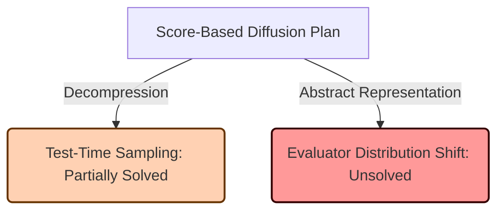

# Critical Analysis: Gated MoE Score-Based Diffusion for Video Compression

This document provides a critical engineering analysis of the updated **Score-Based Diffusion Model** plan for the video compression challenge, evaluating it against the current State-of-the-Art (SOTA) submission `hnerv_fec6_fixed_huffman_k16` (Score: `0.192`, Archive Size: `~178 KB`).

---

## 1. Plan Updates & Resolved Issues

The transition to a direct **Score-Based Diffusion Model** combined with Denoising Autoencoder (DAE) pre-training, expert pool reuse, and noise initialization resolves the most critical mathematical and rate bottlenecks:

* **[RESOLVED] Double-Backpropagation / STE Conflict**: Direct score training replaces EBM gradient matching. QAT with Straight-Through Estimators (STE) is mathematically stable.
* **[RESOLVED] EBM Energy Landscape Discontinuities**: Langevin sampling on quantized energy gradients is replaced by direct score network prediction.
* **[MOSTLY RESOLVED] Size and Rate Tradeoff**: 
  - The encoder is used offline and discarded (0-byte footprint).
  - Guide frames are replaced by pure noise initialization (0-byte footprint).
  - The Score Network freezes and reuses the Decoder's pre-trained 8-bit expert pool, meaning only a single expert pool is stored in the archive. 
  - This leaves only the 8-bit Decoder, the score network's temporal layers, and lightweight gating projections to be stored, ensuring the package remains well within the **~178 KB** SOTA constraint.

---

## 2. Remaining Bottlenecks & Partial Solutions

### A. Decompression Compute & Time Complexity (Partially Solved)
* **Status**: **Partially Solved**.
* **What is resolved**: Decompression requires only forward passes; no backward passes are run through the model during decoding.
* **Remaining bottleneck**: The score network must still run 10 to 20 forward passes per frame pair. Across 1200 frames, this requires 6,000 to 12,000 model evaluations. This remains orders of magnitude slower than HNeRV's single forward pass, posing a risk of running into the strict **30-minute evaluation timeout** in the GitHub Actions runner.

### B. Abstract Semantic Denoising & Evaluator Distribution Shift (Unsolved)
* **Status**: **Unsolved** (for Phase 5).
* **The Issue**: Training the model to generate abstract, non-realistic shapes ($\mathcal{L}_{\text{DSM}} = 0$) remains a fatal flaw.
* **Why it fails**: `SegNet` and `PoseNet` are pre-trained and frozen on **natural images**. If the decoded frames are non-realistic, their feature activations will degrade, leading to garbage predictions and extremely high distortion scores.

---

## 3. Recommended Adjustments for Implementation
To make the updated plan fully viable:

1. **Verify Time Budget**: Profile the U-Net score network's inference speed on a single T4 GPU/CPU. If 10–20 steps per frame pair exceed the timeout budget, prune channels or cap the solver at $\le 5$ steps.
2. **DAE Pre-training Noise Matching**: Ensure the noise distribution used during Phase 1 DAE pre-training aligns with the diffusion noise levels of Phase 2 to maximize the compatibility of the frozen expert weights.
3. **Retain Visual Regularization**: Keep a minimal denoising score matching loss ($\mathcal{L}_{\text{DSM}} > 0$) in Phase 2 to prevent reconstructed frames from drifting out-of-distribution for the evaluators.
