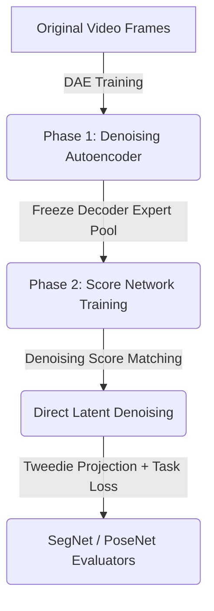

# Core Architecture Design: Gated MoE Score-Based Diffusion Model for Video Compression

This document details the proposed neural architecture, training pipeline, and evaluation integration for the video compression challenge. The objective is to achieve a minimal disk footprint (rate) while preserving semantic and temporal dynamics evaluated by the challenge metrics.

---

## 1. Challenge Evaluation and Test-Time Optimization

### A. Evaluation Metrics and Nuances
The evaluation script (`evaluate.py` from the fork) measures the distortion of reconstructed frames against the original video using two frozen neural models:
1. **SegNet**: Measures semantic distortion as the average class disagreements of predicted semantic masks (e.g., roads, lanes, vehicles) between original and reconstructed frames.
2. **PoseNet**: Measures temporal dynamics distortion as the Mean Squared Error (MSE) of 3D camera ego-motion estimated from consecutive frame pairs.

The final score is calculated as (lower is better):

$$\text{Score} = 100 \cdot \text{segnet\_distortion} + 25 \cdot \text{rate} + \sqrt{10 \cdot \text{posenet\_distortion}}$$

Where $\text{rate} = \frac{\text{size of compressed archive.zip}}{\text{original size}}$.

### B. Test-Time Optimization (Decompression/Inflation)
Since inference compute is unrestricted, we do not perform a simple feed-forward reconstruction during `inflate.sh`. Instead, we formulate decompression as **test-time score-based sampling**:

1. **Compressed Archive**: The archive contains only the quantized 8-bit Score Model $s_\theta(z_t, t)$, the pre-trained 8-bit Decoder, and a single shared expert pool. It contains **no guide frames** or visual anchors.
2. **Reconstruction Initialization**: We initialize the video frames using pure Gaussian noise $z_T \sim \mathcal{N}(0, I)$ generated deterministically from a fixed random seed.
3. **Score-Based Sampling**: We run iterative denoising using a fast ODE/SDE solver (e.g., DDIM) guided by the score model starting from the initialized noise:

$$z_{t-1} \leftarrow g(z_t, s_\theta(z_t, t))$$

4. **Decoding**: Once the denoised latents $z_0$ are obtained, the frozen 8-bit Decoder maps $z_0 \to \hat{x}_0$ to produce the final reconstructed video frames.

---

## 2. Overview of the Single Score-Based Model Paradigm

To optimize representational accuracy and minimize disk footprint:
1. **Offline High-Capacity Encoder (2D)**: An unconstrained, FP32/FP16 encoder optimized offline to project video frames into a low-dimensional latent space. This network is used only during encoding/training and is **not shipped** in the archive.
2. **Pre-trained 8-bit Denoising Decoder**: A parameter-efficient, 8-bit quantized decoder that reconstructs frames from latents. It utilizes a shared pool of 8-bit experts.
3. **Parameter-Efficient 8-bit Score Network**: An 8-bit quantized network that learns the score/noise landscape of the latent space. To minimize parameters, it reuses and freezes the pre-trained expert pool of the Decoder, learning only its own gating projections and temporal layers.

---

## 3. Model Architecture

### A. Spatial Backbone (2D Decoder)
- **Concept**: A spatial 2D U-Net decoder using Depthwise Separable Convolutions and parameter-free PixelShuffle layers.
- **Motivation**:
  - *Depthwise Separable Convolutions*: Separates spatial filtering from channel mixing to reduce parameter count.
  - *PixelShuffle*: Performs deterministic upsampling with zero parameters.
  - *Shared MoE Pool*: A single global pool of 8-bit expert matrices shared across all layers.

### B. Temporal Score Network
- **Concept**: A 2D spatial U-Net conditioned on time, featuring 1D temporal convolutions (kernel size 3 or 5) along the temporal dimension, and conditioned on deterministic sinusoidal time encodings.
- **Motivation**:
  - *Shared Expert Reuse*: Reuses the exact same 8-bit expert pool trained by the Decoder. By freezing these experts, the score network only adds gating projections ($W_{\text{gate}, l}$) to the archive.
  - *Local Convolutions*: Kernel size 3 or 5 convolutions are sufficient to model frame-to-frame dynamics evaluated by PoseNet, avoiding transformer overhead.
  - *Sinusoidal Embeddings*: Computed analytically at runtime (0 parameters) to provide high-frequency temporal coordinates.

---

## 4. Training Pipeline

### Phase 1: Denoising Autoencoder (DAE) Pre-training
We train the high-capacity Encoder and the 8-bit Decoder jointly. We perturb clean latents $z_0$ with noise and train the model to reconstruct the original frames:

$$\mathcal{L}_{\text{DAE}} = \| x - \text{Decoder}(\text{Encoder}(x) + \epsilon) \|^2$$

Pre-training as a DAE forces the Decoder's shared expert pool to learn features that are robust to noise, preparing the expert weights for reuse in the downstream score network.

### Phase 2: Score Network Training (Direct Score Matching)
We freeze the Decoder's parameters and its shared expert pool. We train the Score Model $s_\theta(z_t, t)$ on the latent trajectories using Denoising Score Matching and evaluator task losses:

$$\mathcal{L}_{\text{score}} = \mathcal{L}_{\text{DSM}} + \lambda_1 \mathcal{L}_{\text{SegNet}}(x_0, \hat{x}_0) + \lambda_2 \mathcal{L}_{\text{PoseNet}}(x_0, \hat{x}_0)$$

Where:
- $\hat{z}_0$ is predicted via Tweedie's formula:
  
  $$\hat{z}_0 = \frac{1}{\sqrt{\bar{\alpha}_t}} \left( z_t - \sqrt{1 - \bar{\alpha}_t} s_\theta(z_t, t) \right)$$

- $\hat{x}_0 = \text{Decoder}(\hat{z}_0)$ is the reconstructed frame.
- Gradients backpropagate through the pre-trained Decoder and Tweedie's formula to update only the score network's parameters (temporal layers and gating projections $\theta$).
- Quantization-Aware Training (QAT) with Straight-Through Estimators (STE) is used to optimize the active parameters.

---

## 5. Future Work: Abstract Semantic Denoising via TBPTT-1
As a future investigation, we propose completely discarding the visual reconstruction objective ($\mathcal{L}_{\text{DSM}} = 0$) and optimizing solely for the semantic and geometric evaluations. 

- **Concept**: Train the score model to generate abstract, non-realistic representations (e.g., flat semantic shapes and high-contrast motion tracking points) that satisfy SegNet and PoseNet. 
- **Optimization (TBPTT-1)**: To train on these trajectories without BPTT instability, we propose using **Truncated BPTT with a window size of 1**:
  1. We generate an intermediate state $z_t$ from the previous step and detach it from the gradient graph.
  2. The model performs a single denoising step to produce $z_{t-1}$.
  3. We evaluate the SegNet and PoseNet losses on $\text{Decoder}(z_{t-1})$ (or its Tweedie projection) against the target masks/poses and backpropagate to optimize the parameters for the current step only.
