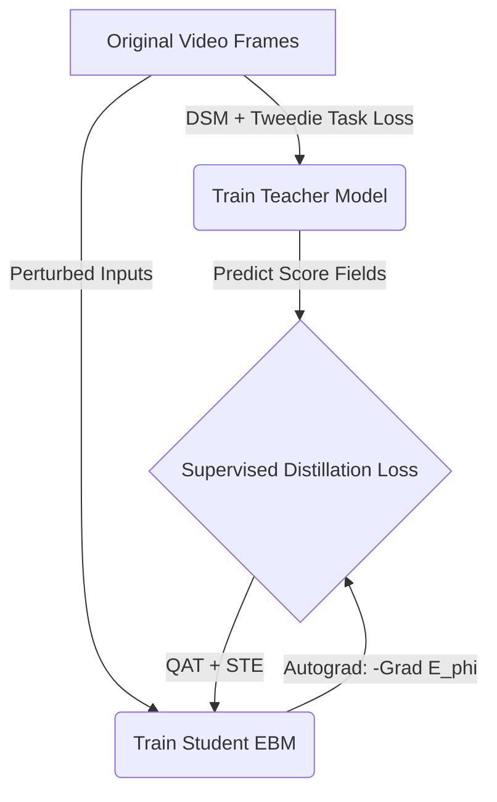

# Core Architecture Design: Gated MoE Energy-Based Model for Video Compression

This document details the proposed neural architecture, training pipeline, and evaluation integration for the video compression challenge. The objective is to achieve a minimal disk footprint (rate) while preserving semantic and temporal dynamics evaluated by the challenge metrics.

---

## 1. Challenge Evaluation and Test-Time Optimization

### A. Evaluation Metrics and Nuances
The evaluation script (`evaluate.py` from the fork) measures the distortion of reconstructed frames against the original video using two frozen neural models:
1. **SegNet**: Measures semantic distortion as the average class disagreements of predicted semantic masks (e.g., roads, lanes, vehicles) between original and reconstructed frames.
2. **PoseNet**: Measures temporal dynamics distortion as the Mean Squared Error (MSE) of 3D camera ego-motion estimated from consecutive frame pairs.

The final score is calculated as (lower is better):

$$\text{Score} = 100 \cdot \text{segnet\_distortion} + 25 \cdot \text{rate} + \sqrt{10 \cdot \text{posenet\_distortion}}$$

Where $\text{rate} = \frac{\text{size of compressed archive.zip}}{\text{original size}}$.

### B. Test-Time Optimization (Decompression/Inflation)
Since inference compute is unrestricted, we do not perform a simple feed-forward reconstruction during `inflate.sh`. Instead, we formulate decompression as a **test-time energy minimization**:

1. **Compressed Archive**: The archive contains only the quantized 8-bit Student EBM $E_\phi(x, t)$ and heavily downsampled, low-resolution guide frame anchors.
2. **Reconstruction Initialization**: We initialize the video frames using bilinear interpolation of the guide anchors.
3. **Energy Minimization**: We run iterative gradient descent to minimize the EBM energy starting from the initialized frames. The update formula is strictly:

$$x_t \leftarrow x_t - \eta \nabla_x E_\phi(x_t, t)$$

- **Constraint Nuance**: We cannot use the SegNet or PoseNet models during inflation because the target semantic masks and 3D camera poses of the original video are unavailable during decoding. Compressing and storing these targets in the archive would destroy the compression rate.
- **Role of the Prior**: The student EBM must rely entirely on its learned parameters to resolve spatial-temporal details around the guide anchors. Because the EBM was distilled from a teacher trained on SegNet/PoseNet losses, its energy landscape implicitly guides the frames toward configurations that naturally satisfy the semantic and geometric evaluators.

---

## 2. Overview of the Two-Model Distillation Paradigm

To bypass the training instability and high computational overhead typically associated with Energy-Based Models (EBMs), we separate the learning process into a two-model paradigm:
1. **Teacher Model (High-Capacity Score Network)**: An unconstrained, high-fidelity model optimized offline to map out the score/noise landscape of the video sequence.
2. **Student Model (Parameter-Efficient 8-bit EBM)**: A highly compressed, 8-bit quantized image-to-scalar model that distills the teacher's score field. During decompression, only this student model is archived, using the test-time energy minimization detailed above to reconstruct the frames.

---

## 3. Teacher Model (High-Capacity Score Network)

The teacher model is optimized solely for representational accuracy (efficacy) during offline training, with no constraints on size, precision, or computation.

### A. Spatial Backbone (2D)
- **Concept**: A high-capacity 2D ResNet-based U-Net featuring standard 2D convolutions (no depthwise separability constraints) and spatial self-attention blocks at lower resolutions.
- **Motivation**: Without parameter or compute constraints, the spatial backbone can utilize dense, high-dimensional filters to preserve micro-textures, fine lines, and complex spatial details of the driving environment. The spatial self-attention layers capture global spatial context (such as the horizon, sky, and road boundaries) that local convolutions struggle to aggregate, ensuring the model establishes a precise structural baseline.

### B. Temporal Modeling
- **Concept**: Global temporal self-attention (Transformer layers) operating across the entire temporal sequence length $T$.
- **Motivation**: Full temporal self-attention allows any frame in the video to query any other frame. This enables the teacher to easily model global temporal patterns, camera ego-motion drift, and repeating background structures (e.g., static landscapes or repeating roadside elements). It provides the most mathematically expressive way to capture global temporal dynamics, which is crucial for establishing an accurate motion score field for the downstream PoseNet evaluation.

### C. Weight and Capacity Configuration
- **Concept**: Unconstrained FP32 or FP16 precision, large model footprint (e.g., 50M+ parameters) with zero quantization, pruning, or expert-sharing constraints.
- **Motivation**: Retaining full floating-point precision prevents quantization noise from degrading the gradients during score-matching optimization. A high parameter count ensures that the teacher does not suffer from underfitting, acting as a high-fidelity continuous probability density estimator (oracle) of the video sequence.

---

## 4. Student Model (Parameter-Efficient 8-bit EBM)

The student model is designed for a minimal disk footprint, translating the score field into a highly compressed, 8-bit quantized image-to-scalar EBM.

### A. Spatial Backbone (2D)
- **Concept**: A spatial 2D U-Net encoder using Depthwise Separable Convolutions and parameter-free PixelShuffle/PixelUnshuffle layers.
- **Motivation**:
  - *Depthwise Separable Convolutions*: Separating spatial filtering from channel mixing reduces the parameter count of standard $3\times3$ convolutions by approximately $9\times$.
  - *PixelShuffle / PixelUnshuffle*: Standard downsampling (strided convs) and upsampling (transposed convs) require learnable weights. PixelShuffle and PixelUnshuffle are purely deterministic tensor reshaping operations that require zero parameters, preserving spatial information without taking up space on disk.
  - *Recursive Parameter Sharing*: Sharing weights recursively across the downsampling stages allows the network to reuse the same convolutional filters across multiple scales, further compressing the model footprint.

### B. Temporal Modeling
- **Concept**: Small 1D temporal convolutions (kernel size 3 or 5) along the temporal dimension, conditioned on deterministic sinusoidal time encodings.
- **Motivation**:
  - *Local Convolutions*: The PoseNet evaluator only measures geometric consistency between consecutive frame pairs. A small local receptive field ($K=3$ or $K=5$) is sufficient to smooth out frame-to-frame transitions and prevent optical flow jitter without the need for large-kernel parameters or complex global temporal models.
  - *Sinusoidal Embeddings*: Storing learned frame-wise embeddings $e_t$ requires a $T \times d$ tensor. Sinusoidal time embeddings are computed analytically at runtime (zero parameters to store), saving disk space. They provide high-frequency global coordinates so the network can locate its temporal position, while the local convolutions handle transition dynamics.

### C. Parameter Multiplexing: Cross-Layer Shared MoE Pool
- **Concept**: A single global pool of 8-bit expert matrices shared across all layers of the network.
- **Motivation**:
  - *Cross-Layer Sharing*: Standard MoE maintains private experts per layer, which scales parameters linearly with depth. Sharing the same pool of experts across all layers decouples the model's depth from its parameter count, allowing deep computational hierarchies with a fixed, small pool of experts.
  - *Uniform Dimensions*: All participating layers are designed with uniform hidden dimensions to ensure compatibility with the shared expert pool.

### D. Activation-Based MoE Gating
- **Concept**: Routing inputs to the shared experts dynamically using gating coefficients computed from the layer's activation features at runtime (e.g., $g_l(x) = \text{softmax}(W_{\text{gate}, l} x)$).
- **Motivation**:
  - *Zero Per-Frame Storage*: Because the routing is determined entirely by the layer's intermediate activation features at runtime, we do not need to store any per-frame routing codes or latents in the compressed archive. The only parameters required are the lightweight gating projections ($W_{\text{gate}, l}$) which are shared and stored once.
  - *Dynamic Capacity*: Features at different layers dynamically route themselves to the most relevant expert in the global pool, maximizing weight sharing and functional adaptability.
  - *LFQ Alternative Note*: If activation-based routing lacks sufficient global temporal control, an alternative is to store a $d$-bit Lookup-Free Quantization (LFQ) coordinate on a binary hypercube $\{-1, 1\}^d$ per frame. These bits are projected to gating coefficients using layer-specific projection matrices ($P_l$). This alternative introduces a tiny per-frame storage cost ($d$ bits/frame) but offers explicit, discrete temporal state control over the routing topology.

---

## 5. Training and Distillation Pipeline

### Phase 1: Teacher Training
We train the high-capacity Teacher Score Model $s_\theta(x, t)$ on the target video frames. The optimization objective is a joint loss that balances pixel-level reconstruction with semantic and geometric alignment:

$$\mathcal{L}_{\text{teacher}} = \mathcal{L}_{\text{DSM}} + \lambda_1 \mathcal{L}_{\text{SegNet}}(x_0, \hat{x}_0) + \lambda_2 \mathcal{L}_{\text{PoseNet}}(x_0, \hat{x}_0)$$

Where:
- $\mathcal{L}_{\text{DSM}}$ is the standard Denoising Score Matching loss (forcing the model to learn the score field of the original video distribution).
- $\hat{x}_0$ is the clean frame predicted at any noise level $t$ using Tweedie's formula:
  
  $$\hat{x}_0 = \frac{1}{\sqrt{\bar{\alpha}_t}} \left( x_t - \sqrt{1 - \bar{\alpha}_t} s_\theta(x_t, t) \right)$$

Because the estimated clean frame $\hat{x}_0$ is fully differentiable with respect to the score network's output, the SegNet and PoseNet losses backpropagate directly through Tweedie's formula to update the parameters $\theta$. This forces the teacher to prioritize the semantic boundaries and motion structures required by the evaluators.

### Phase 2: EBM Distillation (Student Training)
We distill the teacher's score field into the student EBM $E_\phi(x, t)$. We optimize the student's parameters $\phi$ using a supervised gradient matching loss:

$$L_{\text{distill}}(\phi) = \mathbb{E}_{x, t} \left\| -\nabla_x E_\phi(x, t) - s_\theta(x, t) \right\|^2$$

- **Autograd Score Derivation**: The student's score mapping is computed analytically via a backward pass: $s_\phi(x, t) = -\nabla_x E_\phi(x, t)$.
- **Quantization-Aware Training (QAT)**: We apply fake quantization layers to the student's weights and activations. Gradients flow through the quantization operations using Straight-Through Estimators (STE).
- **Stability**: This distillation is highly stable because the target score field $s_\theta(x, t)$ is frozen, eliminating the partition function estimation and the need for in-loop MCMC sampling.

### Phase 3: Future Work - Abstract Semantic Denoising via TBPTT-1
As a future investigation, we propose completely discarding the visual reconstruction objective ($\mathcal{L}_{\text{DSM}} = 0$) and optimizing solely for the semantic and geometric evaluations. 

- **Concept**: Train the EBM to generate abstract, non-realistic representations (e.g., flat semantic shapes and high-contrast motion tracking points) that satisfy SegNet and PoseNet. Because these representations lack natural textures, they are significantly easier to compress.
- **Optimization (TBPTT-1)**: To train on these new trajectories without Backpropagation Through Time (BPTT), we propose using **Truncated BPTT with a window size of 1**:
  1. We generate an intermediate state $x_t$ from the previous step and detach it from the gradient graph (treating it as a constant).
  2. The model performs a single denoising step to produce $x_{t-1}$.
  3. We evaluate the SegNet and PoseNet losses on $x_{t-1}$ (or its Tweedie projection) against the target masks/poses and backpropagate to optimize the parameters for the current step only.
- **Efficacy**: This eliminates the memory and gradient instability of BPTT while completely resolving exposure bias, as the model is trained directly on the out-of-distribution intermediate states generated by its own parameters.
